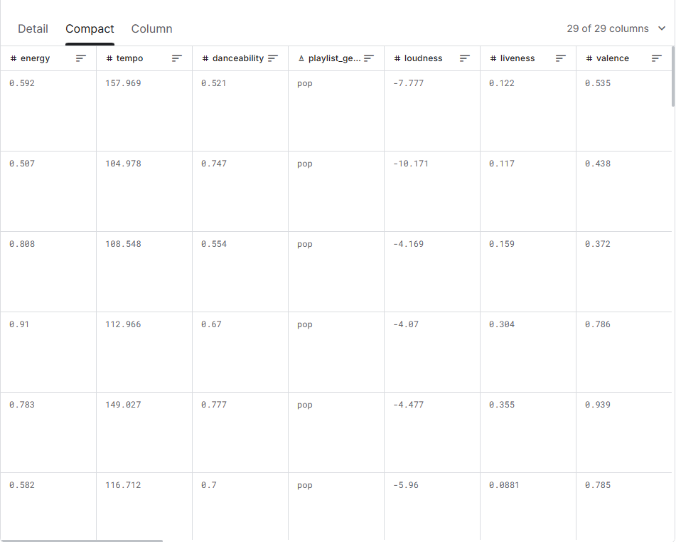
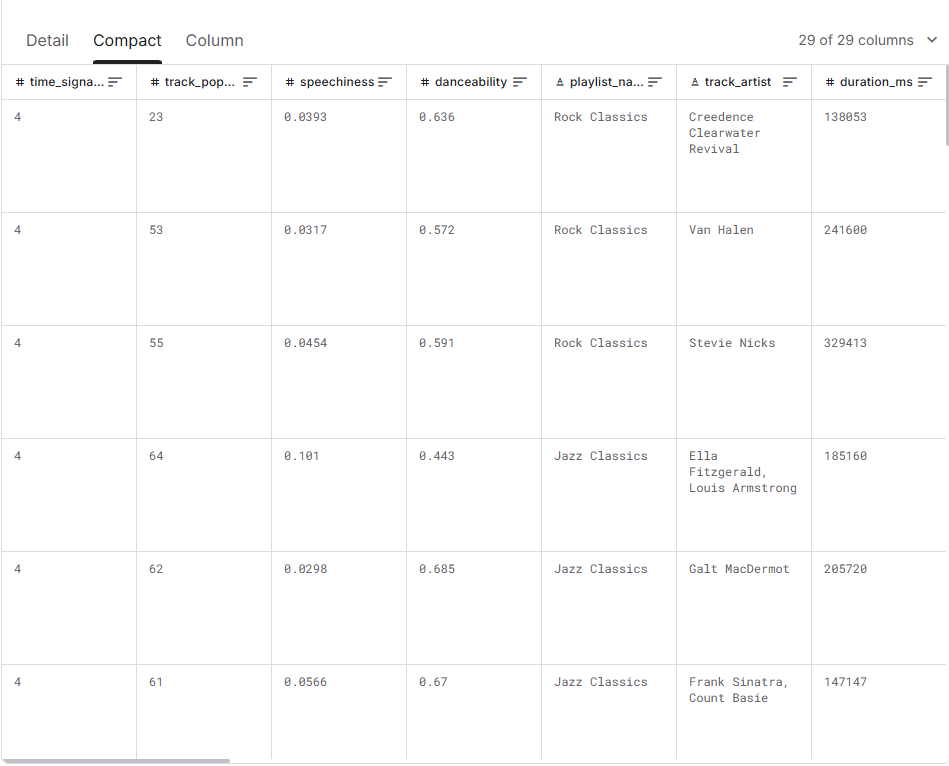

# CSC173 Deep Computer Vision Project Progress Report
**Student:** [Joseph Jr Q. Corpuz], [2020-1360]  
**Date:** [12-16-2025]  
**Repository:** [https://github.com/MeatiusMax/CSC172-AssociationMining-Corpuz-] 

## 📊 Current Status
| Milestone | Status | Notes |
|-----------|--------|-------|
| Dataset Preparation | ✅ Completed | Combined high/low popularity CSVs; added labels; handling missing values |
| Feature Discretization | ✅ Completed| Converted features to categorical bins|
| Transaction Formatting | ⏳ Pending | Transform rows to itemset, Planned for tomorrow |
| FP-Growth Mining | ⏳ Not Started | Planned for tomorrow |

## 1. Dataset Progress
- **Source files:** [high_popularity_spotify_data.csv, low_popularity_spotify_data.csv]
- **Total Tracks:** [4000]
- **Popularity label:** [low for unpopular, high for popular]
- **Features:** [energy, danceability, valence, loudness, tempo, acousticness, instrumentalness, speechiness, liveness, mode, playlist_genre]

**Sample data preview:**

## 2. Challenges Encountered & Solutions
| Issue | Status | Resolution |
|-------|--------|------------|
| Accidentaly Overwritten columns | ✅ Fixed | created new _descretized for clarity |
| Bin labels were hard to read | ✅ Fixed | Used descriptive names |

## 3. Next Steps (Before Final Submission)
- [ ] Convert DataFrame into list of transactions
- [ ] Run FP-Growth with mlxtend
- [ ] Generate and filter association rules by popularity_label
- [ ] Graphs for clarity